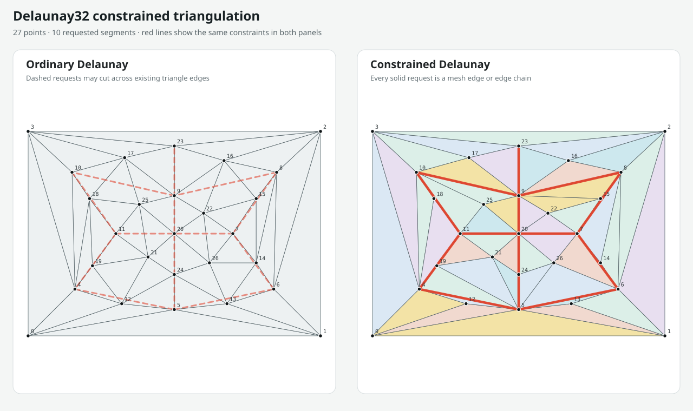
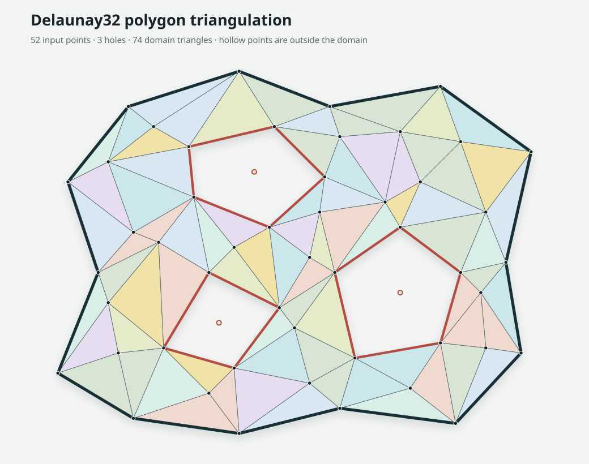

# Delaunay32

**Fast, parallel 2D Delaunay triangulation using exact integer predicates, with direct float input.**


`Delaunay32` is a C++17 library for triangulating large sets of discrete 2D
points: pixels, raster samples, voxel projections, fixed-point geometry, and
other quantized spatial data. Finite `float` points can also be passed directly;
the library quantizes them internally while output indices continue to
reference the original coordinates.

It combines exact integer predicates with a Morton-ordered divide-and-conquer
algorithm, compact two-dart topology, and optional multithreading. The result is
a triangulator that is deterministic, robust, and particularly fast on large
point sets.

For large point sets, Delaunay32 is over 10× faster than [delaunator-cpp](https://github.com/delfrrr/delaunator-cpp) and around 3× faster than [Fade2D](https://www.geom.at/products/fade2d/).

## Highlights

- Exact orientation and in-circle predicates for certified coordinate ranges
- Signed 32-bit integer input, including negative coordinates and large offsets
- Serial and shared-memory parallel execution
- Deterministic handling of duplicate points
- Constrained Delaunay triangulation for noncrossing integer segments
- Triangle indices referencing the original input, counterclockwise on the
  triangulation grid
- Opt-in halfedge adjacency, convex hull, and duplicate representative mapping
- Automatic, fixed-step, or fixed-scale float quantization with
  precision limits and collision policies
- MIT licensed and dependency-free for normal library use

## Documentation

- [Usage guide](docs/usage.md): complete API, type, exactness, quantization,
  threading, and error contracts
- [Changelog](CHANGELOG.md): release notes and breaking API changes
- [Float SVG example](examples/delaunay_float_example.cpp): end-to-end float
  input with a `QuantizationReport`
- [Constrained SVG example](examples/delaunay_constrained_example.cpp):
  ordinary and constrained triangulations of the same fixed geometry
- [Polygon SVG example](examples/delaunay_polygon_example.cpp): a concave
  integer domain with three holes and points omitted by domain clipping
- [Polygon logo SVG example](examples/delaunay32_logo_polygon_example.cpp):
  fresh blue-noise points inside ten JSON-defined polygonal glyph domains
- [Integer SVG example](examples/delaunay_svg_example.cpp): generated or JSON
  integer input

## When to use it

`Delaunay32` is intended for data that is already discrete or can tolerate a
high-resolution uniform quantization. Typical examples include image-space
geometry, raster and height-field samples, projected voxel data, fixed-point
maps, graphics, and projected spatial datasets.

Direct float input is practical for most graphics, mapping, visualization, and
general meshing applications where exact edge topology is not required.
`triangulate_float()` keeps source coordinates untouched and returns indices
into the original input. Only the edge decisions use internally quantized
integer coordinates.

The resulting mesh will normally be very close to one computed directly from
the source values, but its edges are not guaranteed to be identical.
Differences are most likely for nearly coincident, collinear, or cocircular
points. Use an adaptive-exact triangulator when the precise Delaunay topology
of the original floating-point coordinates is required.

## Performance

The benchmark compares `Delaunay32` with
[Delaunator](https://github.com/mapbox/delaunator), a widely used,
high-performance open-source Delaunay implementation originally developed by
Mapbox. It uses
[delaunator-cpp](https://github.com/delfrrr/delaunator-cpp), whose maintainers
describe it as probably the fastest open-source C++ implementation.

Delaunator-cpp is included only as an optional benchmark submodule. `Delaunay32`
does not wrap it or depend on it as part of the triangulation algorithm.
The published tables measure ordinary point-set triangulation; constrained
segment recovery is not included in those timings.

### Headline results

For one million input points:

| distribution | Delaunay32 1T | Delaunay32 auto | Delaunator | serial speedup | auto speedup |
|:--|--:|--:|--:|--:|--:|
| uniform | 147.909 ms | 51.741 ms | 551.592 ms | 3.73× | 10.66× |
| clustered | 143.195 ms | 47.979 ms | 542.438 ms | 3.79× | 11.31× |
| diagonal | 144.347 ms | 49.935 ms | 545.491 ms | 3.78× | 10.92× |

A same-process benchmark (not included in this repo) at one million points measured Delaunay32 to be:

3.7–4.3× as fast as single-threaded [Fade2D](https://www.geom.at/products/fade2d/).    
2.6–3.5× as fast as automatically threaded [Fade2D](https://www.geom.at/products/fade2d/).   

As always, benchmark results are machine- and workload-specific. Run the
included benchmark on your target hardware before making deployment decisions.

### Full benchmark

These are median end-to-end times from a Release build on an Apple M1
(8 cores, 16 GB) using Apple Clang 21. The deterministic inputs contain unique
points in `[0, 100000)²`.

Input generation and validation are excluded. Input ingestion by `Delaunay32`
and output triangle materialization by both implementations are included. The
default fresh-instance lifecycle also includes `Triangulator` construction,
working-storage teardown, and worker-thread lifetime for every sample.

Delaunator's `std::vector<double>` is prepared once outside the timed region,
giving it the favorable assumption that its input is already available in its
native representation. In the ratio columns, lower is better.

| distribution | points | Delaunay32 1T ms | Delaunay32 auto ms | threads | Delaunator ms | 1T / del | auto / del |
|:--|--:|--:|--:|--:|--:|--:|--:|
| uniform | 1,000 | 0.147 | 0.147 | 1 | 0.295 | 0.498x | 0.498x |
| uniform | 10,000 | 1.369 | 1.363 | 1 | 3.052 | 0.449x | 0.447x |
| uniform | 100,000 | 14.317 | 5.658 | 8 | 39.837 | 0.359x | 0.142x |
| uniform | 1,000,000 | 147.909 | 51.741 | 8 | 551.592 | 0.268x | 0.094x |
| clustered | 1,000 | 0.093 | 0.093 | 1 | 0.221 | 0.419x | 0.420x |
| clustered | 10,000 | 1.343 | 1.355 | 1 | 3.260 | 0.412x | 0.416x |
| clustered | 100,000 | 14.051 | 5.354 | 8 | 39.629 | 0.355x | 0.135x |
| clustered | 1,000,000 | 143.195 | 47.979 | 8 | 542.438 | 0.264x | 0.088x |
| diagonal | 1,000 | 0.097 | 0.095 | 1 | 0.242 | 0.400x | 0.390x |
| diagonal | 10,000 | 1.376 | 1.375 | 1 | 3.159 | 0.436x | 0.435x |
| diagonal | 100,000 | 14.318 | 5.838 | 8 | 39.682 | 0.361x | 0.147x |
| diagonal | 1,000,000 | 144.347 | 49.935 | 8 | 545.491 | 0.265x | 0.092x |

## Quick start

Clone the repository and initialize the optional benchmark dependency:

```sh
git submodule update --init --recursive
cmake -S . -B build -DCMAKE_BUILD_TYPE=Release
cmake --build build -j
ctest --test-dir build --output-on-failure
```

For a library-only build, Delaunator is not required:

```sh
cmake -S . -B build \
  -DCMAKE_BUILD_TYPE=Release \
  -DDELAUNAY32_BUILD_BENCHMARKS=OFF \
  -DDELAUNAY32_BUILD_TESTS=OFF \
  -DDELAUNAY32_BUILD_EXAMPLES=OFF
cmake --build build -j
```

Install with:

```sh
cmake --install build
```

### Windows with MSVC

Install Visual Studio with the **Desktop development with C++** workload, plus
Git and CMake. From PowerShell, use the multi-configuration Visual Studio
generator as follows:

```powershell
git submodule update --init --recursive
cmake -S . -B build
cmake --build build --config Release --parallel
ctest --test-dir build -C Release --output-on-failure
cmake --install build --config Release
```

Unlike single-configuration Linux and macOS builds, Visual Studio selects the
configuration when building, testing, and installing. Built executables are
therefore under `build\Release\`, for example
`build\Release\delaunay_benchmark.exe`.

The exported CMake target is `delaunay32::delaunay32`.

## Usage

### Integer input

```cpp
#include <delaunay32/delaunay.hpp>

#include <vector>

int main() {
    std::vector<delaunay32::Point> points = {
        {0, 0},
        {100, 0},
        {100, 100},
        {0, 100},
        {48, 37},
    };

    // 1 selects the serial path; 0 selects the hardware thread count.
    delaunay32::Triangulator triangulator(0);
    const std::vector<delaunay32::Triangle> triangles =
        triangulator.triangulate_int(points);

    for (const auto& triangle : triangles) {
        // i0, i1, and i2 index the original point vector in CCW order.
    }
}
```

### Floating-point input

Pass finite float coordinates directly as `FloatPoint` values. No manual
conversion or quantization is required:

```cpp
std::vector<delaunay32::FloatPoint> points = {
    {0.125F, 0.25F},
    {5.5F, 0.1F},
    {6.0F, 4.5F},
    {-1.0F, 5.0F},
};

const std::vector<delaunay32::Triangle> triangles =
    triangulator.triangulate_float(points);

// Triangle indices address the unchanged FloatPoint vector.
for (const auto& triangle : triangles) {
    const auto& a = points[triangle.i0];
    const auto& b = points[triangle.i1];
    const auto& c = points[triangle.i2];
    // Use a, b, and c with their original float coordinates.
}
```

Use `triangulate_float_full(points)` when quantization details, adjacency, the
convex hull, or representative mappings are needed. Its `quantization` field
reports the grid step, measured coordinate error, and point collisions.

`QuantizationOptions` can provide a stable mapping across separate batches:

```cpp
delaunay32::QuantizationOptions options;
options.mode = delaunay32::QuantizationMode::FixedScale;
options.origin_x = 0.0;
options.origin_y = 0.0;
options.scale = 1000.0;

const auto triangles = triangulator.triangulate_float(points, options);
```

The returned vertices retain their original precision. The connectivity is
computed on the internal integer grid, so edge choices can differ from an exact
Delaunay triangulation of the original floating-point values, particularly near
geometric degeneracies.

### Constrained integer input

Pass edges as pairs of indices into the same integer point vector:

```cpp
std::vector<delaunay32::Constraint> constraints = {
    {0, 2},
    {2, 4},
};

const std::vector<delaunay32::Triangle> triangles =
    triangulator.triangulate_constrained_int(points, constraints);
```

The result triangulates the full convex hull while preserving every constraint
as a mesh edge or, when an existing point lies on the segment, as a chain of
mesh edges. Proper crossings away from an existing point are rejected.

### Polygon input with holes

Polygon rings are indices into the same point vector. The closing edge is
implicit, although repeating the first index at the end is also accepted:

```cpp
std::vector<std::uint32_t> outer = {0, 1, 2, 3};
std::vector<std::vector<std::uint32_t>> holes = {
    {4, 5, 6, 7},
};

const std::vector<delaunay32::Triangle> triangles =
    triangulator.triangulate_polygon_int(points, outer, holes);
```

The call normalizes ring winding, recovers every boundary as constrained edge
chains, and returns only triangles inside `outer` and outside every hole.
Points outside that domain remain valid input but do not appear in the result.
Rings must be simple and may not cross or touch one another. Holes must be
strictly inside the outer ring and may not overlap or nest. The implementation
does not insert intersection or Steiner points.

A `Triangulator` can be reused across calls to retain working storage and worker
threads. A single instance must not be called concurrently; separate instances
are independent.

### Full result

Use the opt-in result API when traversal or input correspondence is needed:

```cpp
const delaunay32::TriangulationResult result =
    triangulator.triangulate_int_full(points);

// result.triangles       face indices, as in triangulate_int()
// result.halfedges       opposite flattened edge, or -1 on the hull
// result.hull            counterclockwise original input indices
// result.representatives input index -> retained representative index
```

The result also reports the predicate width and actual thread count.
Floating-point results include their `QuantizationReport`. The triangle-only
APIs do not construct any of the additional fields.

The [usage guide](docs/usage.md) gives the exact integer span limits, explains
every `QuantizationReport` field, lists all overloads and exceptions, and covers
duplicates, collinear input, winding, threading, and platform differences.

## How it works

At a high level, Delaunay32:

1. translates coordinates by the input minima and certifies predicate widths;
2. generates Morton keys and radix-sorts the sites;
3. constructs small divide-and-conquer leaves using exact orientation and
   in-circle predicates;
4. merges neighboring triangulations through compact primal edge rings;
5. optionally recovers constrained segments with in-place edge flips and
   legalizes every unconstrained edge;
6. optionally flood-fills polygon exteriors and holes without crossing their
   constrained boundaries;
7. marks the outer face and materializes indices that are counterclockwise in
   the triangulation coordinates.

For large inputs, radix sorting, independent subtrees, merge levels, and
triangle export share a retained worker team. Small inputs stay serial to avoid
synchronization overhead.

The architecture belongs to the established divide-and-conquer Delaunay family,
particularly:

- L. Guibas and J. Stolfi, *Primitives for the Manipulation of General
  Subdivisions and the Computation of Voronoi Diagrams* (1985)
- R. A. Dwyer, *A Faster Divide-and-Conquer Algorithm for Constructing
  Delaunay Triangulations* (1987)

## Running the benchmark

```sh
./build/delaunay_benchmark
./build/delaunay_benchmark --quick
./build/delaunay_benchmark --reuse
./build/delaunay_benchmark --format markdown
./build/delaunay_benchmark --format csv
./build/delaunay_benchmark --sizes 1000,10000,1000000
```

Each case is checked against Delaunator before timing. Validation first attempts
an exact unoriented triangle-set match. Where cocircular points permit a
different valid diagonal, it instead requires equal triangle counts and checks
manifold edge incidence and exact local Delaunay legality.

The benchmark rotates implementation order and reports medians. Dataset
generation, seeds, validation, and timing boundaries are defined in
`benchmarks/benchmark.cpp` and `benchmarks/support.hpp`.

Full runs use 11 samples through 10,000 points, 7 samples at 100,000 points, and
5 samples above 100,000 points. `--quick` uses 3 samples.

The default `--fresh` mode constructs and destroys a `Triangulator` for each
measured sample, including working-storage and thread-pool lifetime. `--reuse`
models repeated triangulations through one retained instance.

## SVG examples

### Random float points

`delaunay_float_example` is a compact end-to-end example of the quantized float
API. It generates 5,000 deterministic random `FloatPoint` values, triangulates
them with a `QuantizationReport`, prints the mapping and precision information,
and writes an SVG using the unchanged source coordinates addressed by the
returned triangle indices.

```sh
cmake -S . -B build-debug -DCMAKE_BUILD_TYPE=Debug
cmake --build build-debug --target delaunay_float_example --parallel
./build-debug/delaunay_float_example float-mesh.svg
```

On macOS, inspect the result with:

```sh
open float-mesh.svg
```

The example keeps its point count, seed, and rectangular float bounds as named
constants near the top of `examples/delaunay_float_example.cpp`, making them
easy to change while keeping the API flow uncluttered.

### Constrained integer comparison

The constrained example loads a fixed geometry, computes both ordinary and
constrained Delaunay triangulations, and writes them side by side. Requested
segments are dashed over the ordinary mesh and solid over the recovered mesh.
The fixture includes segments that pass through and meet at existing points.



```sh
cmake --build build-debug --target delaunay_constrained_example --parallel
./build-debug/delaunay_constrained_example \
  examples/data/constrained.json constrained.svg
```

The example code is in
[`delaunay_constrained_example.cpp`](examples/delaunay_constrained_example.cpp),
and its editable point set is
[`constrained.json`](examples/data/constrained.json).

### Polygon with holes

The polygon example reads indexed outer and hole rings, performs constrained
Delaunay triangulation and domain filtering, and renders both retained and
omitted input points. Hollow red points lie inside holes and therefore do not
appear in any returned triangle.



```sh
cmake --build build-debug --target delaunay_polygon_example --parallel
./build-debug/delaunay_polygon_example \
  examples/data/polygon.json polygon.svg
```

The example code is in
[`delaunay_polygon_example.cpp`](examples/delaunay_polygon_example.cpp), and
its editable geometry is [`polygon.json`](examples/data/polygon.json).

### Polygon-constrained logo

This separate example reads ten independent glyph domains from JSON and
generates 625 new boundary-aware best-candidate blue-noise points inside them
on every run. For each point, it keeps the best of 16 random candidates based
on distance from the domain boundary and previously accepted points. The
fixture stores only high-resolution integer outline vertices and their outer
and hole rings; it contains no generated mesh points. Consequently there is no
random exterior cloud and no runtime font or text-rendering dependency.

```sh
cmake --build build-debug --target delaunay32_logo_polygon_example --parallel
./build-debug/delaunay32_logo_polygon_example \
  examples/data/delaunay32_logo.json delaunay32-logo-polygon.svg
```

The example code is in
[`delaunay32_logo_polygon_example.cpp`](examples/delaunay32_logo_polygon_example.cpp),
its outline fixture is
[`delaunay32_logo.json`](examples/data/delaunay32_logo.json), and the original
integer SVG example and image remain intact.

### Integer points and JSON input

The dependency-free example accepts arbitrary signed integer points from a
JSON geometry file:

```json
{
  "points": [[0, 0], [500, 0], [1000, 0], [500, 500]]
}
```

It reads the points exactly as supplied and scales the SVG to the input bounds
while preserving its aspect ratio.

```sh
./build/delaunay_svg_example \
  --input examples/data/delaunay32.json \
  --output delaunay32.svg
```

With no JSON input, the original random mode remains available:

```sh
./build/delaunay_svg_example 100000 mesh.svg 42
```

Random mode generates unique interior points and inserts the four square
corners. Its point count includes those corners. In JSON mode, the file must
contain every desired point, including any boundary and corner points; the
example does not add or remove points.

The example-only JSON schema also accepts optional topology without adding a
JSON dependency to the library:

```json
{
  "points": [[0, 0], [100, 0], [100, 100], [0, 100]],
  "constraints": [[0, 2]],
  "polygon": {
    "outer": [0, 1, 2, 3],
    "holes": []
  }
}
```

`constraints` drives the constrained example. `polygon.outer` and
`polygon.holes` contain the point indices accepted by
`triangulate_polygon_int()`. A `polygons` array can hold multiple objects with
the same `outer` and `holes` fields over one shared points array; `polygon` and
`polygons` are mutually exclusive.

## Development

Performance changes should pass the validation suite, improve the full
benchmark geometric mean, and avoid serious regressions in any large case.
Failed experimental kernels should remain outside the main branch so the
production path stays readable.

## Versioning and releases

Delaunay32 follows Semantic Versioning. The version in `CMakeLists.txt` is the
single source of truth, and published releases use annotated tags such as
`v0.4.0`. Tags are created from tested commits on `main`, never from feature
branches. See the [release process](docs/releasing.md) for the checklist.

## Scope

Included:

- signed 32-bit integer coordinates
- finite float coordinates through configurable uniform quantization
- exact certified predicates
- deterministic duplicate handling
- constrained Delaunay edges for integer input
- constrained Delaunay polygon domains with holes for integer input
- serial and shared-memory parallel construction
- triangle indices that are counterclockwise on the triangulation grid
- up to `2^31 - 1` input entries, subject to available memory

Not included:

- exact predicates on the unquantized floating-point coordinates
- automatic intersection or Steiner vertices
- dynamic insertion or deletion
- Voronoi output

## License

The library and repository-owned utilities are MIT licensed. The optional
Delaunator benchmark submodule has its own permissive notices; see
[THIRD_PARTY.md](THIRD_PARTY.md).
