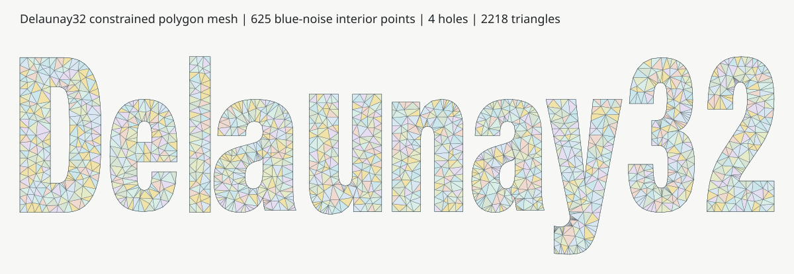

# Delaunay32

**Fast, parallel 2D Delaunay triangulation for signed 32-bit integer points.**



Delaunay32 is a C++17 library built around exact integer predicates. A reusable
`Triangulator` receives points, constraints, and polygon domains as one
configured problem, then builds and exports the topology in a single
`triangulate()` call.

The core API accepts `std::int32_t` coordinates exclusively. Floating-point
input is converted explicitly with the standalone `quantize()` utility before
it reaches the triangulator.

## Performance

Approximate runtime for one million unconstrained points on the reference
Apple M1 system, normalized to eight-thread Delaunay32. Lower is better:

| Implementation | Threads | Relative runtime |
|:--|--:|--:|
| **Delaunay32** | **8** | **1.0×** |
| **Delaunay32** | **1** | **~2.8×** |
| [Fade2D](https://www.geom.at/products/fade2d/) 2.17.3 | automatic | ~4.5× |
| [Fade2D](https://www.geom.at/products/fade2d/) 2.17.3 | 1 | ~6.0× |
| [delaunator-cpp](https://github.com/delfrrr/delaunator-cpp) | 1 | ~11× |
| [Triangle](https://www.cs.cmu.edu/~quake/triangle.html) 1.6 | 1 | ~11× |

These rounded results come from separate Release-build runs and vary with
machine and input distribution.

## Features

- Exact predicates for every accepted integer input
- Serial or shared-memory parallel execution
- Deterministic coincident-point handling
- Standalone constraints and disjoint polygon domains with holes
- One batched topology for constraints and all polygon boundaries
- Triangle-only or full topology results with an operation report
- Explicit, configurable float-to-integer quantization
- Original input indices in every returned triangle
- No bundled third-party source dependencies

## Build

The default top-level build includes the library, extras, tests, benchmark, and
the complete example suite:

```sh
cmake -S . -B build -DCMAKE_BUILD_TYPE=Release
cmake --build build --parallel
ctest --test-dir build --output-on-failure
```

For a library-only build:

```sh
cmake -S . -B build \
  -DDELAUNAY32_BUILD_BENCHMARKS=OFF \
  -DDELAUNAY32_BUILD_EXTRAS=OFF \
  -DDELAUNAY32_BUILD_EXAMPLES=OFF \
  -DDELAUNAY32_BUILD_TESTS=OFF
cmake --build build --parallel
```

Link the core CMake target as `delaunay32::delaunay32`. Optional JSON,
sampling, and SVG utilities are available through `delaunay32::extras`.

## Use

```cpp
#include <delaunay32/delaunay.hpp>

#include <vector>

int main() {
    const std::vector<delaunay32::Point> points = {
        {0, 0}, {100, 0}, {100, 100}, {0, 100}, {48, 37},
    };

    delaunay32::TriangulationOptions options;
    options.thread_count = 0; // Select the hardware thread count.

    delaunay32::Triangulator triangulator;
    triangulator.set_options(options);
    triangulator.set_points(points);
    const delaunay32::TriangulationResult result =
        triangulator.triangulate();

    for (const delaunay32::Triangle& triangle : result.triangles) {
        const auto& a = points[triangle.i0];
        const auto& b = points[triangle.i1];
        const auto& c = points[triangle.i2];
        // a, b, c are counterclockwise.
    }
}
```

`triangulate()` consumes the configured problem, including when it throws.
Call `set_points()` to begin another problem. This clears the previous
constraints and polygon domains while preserving options, allocations, and
worker threads.

Constraints and polygons are configured before the run:

```cpp
triangulator.set_points(points);
triangulator.set_constraints(constraints);
triangulator.set_polygons(polygons);
const auto result = triangulator.triangulate();
```

For adjacency, the complete input hull, and duplicate representatives, select
`ResultDetail::Full`. Triangle detail is the default.

Floating-point conversion is deliberately separate:

```cpp
#include <delaunay32/quantization.hpp>

const delaunay32::QuantizationResult converted =
    delaunay32::quantize(float_points);

triangulator.set_points(converted.points);
const auto result = triangulator.triangulate();
```

The converted vector preserves the source length and index order. Its
`QuantizationReport` records the mapping, measured error, and collisions.

## More

- [Usage guide](docs/usage.md) — lifecycle, quantization, constraints, polygons, and results
- [Hello mesh example](examples/delaunay32_hello_mesh_example.cpp) — minimal fixed-point triangulation and SVG output
- [Constraints example](examples/delaunay32_constraints_example.cpp) — require a simple indexed polyline in the mesh
- [Polygon example](examples/delaunay32_polygon_example.cpp) — triangulate one outer ring with one hole
- [Quantization example](examples/delaunay32_quantization_example.cpp) — large nearby floats, conversion modes, reports, and rejection policies
- [Logo example](examples/delaunay32_logo_polygon_example.cpp) — one batched multi-domain run
- [Changelog](CHANGELOG.md) — release history and breaking changes
- [Release process](docs/releasing.md) — maintainer checklist

Run `./build/delaunay_benchmark --quick` for a short local performance run
across uniform, clustered, and diagonal point distributions.

## License

MIT. See [LICENSE](LICENSE). Third-party dependency status is recorded in
[THIRD_PARTY.md](THIRD_PARTY.md).
